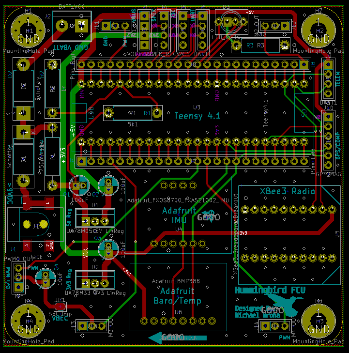
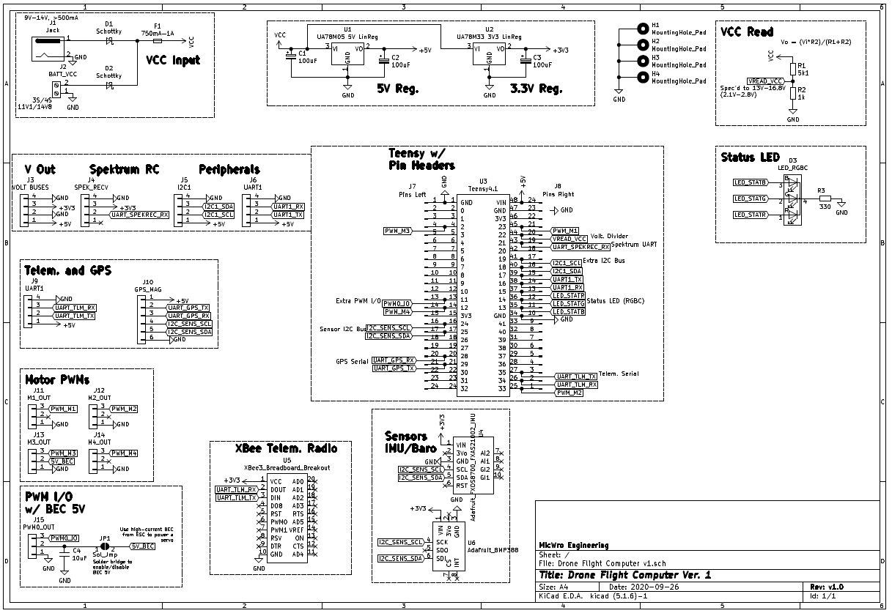

# Hummingbird FCU Quadcopter Flight Software

Flight software for the Hummingbird Flight Control Unit quadcopter flight controller. Designed to run on the Teensy 4.1. Developed with VSCode+PlatformIO.

**Developed By:** Michael Wrona, *B.S. Aerospace Engineering*

* Blog: [mwrona.com](https://mwrona.com/)
* YouTube: [@MicWro Engr](https://www.youtube.com/channel/UCIeZzuXHGm7zqSFvT8xGoIQ)

This project is very much a work in progress. Stop by every so often to see my progress!

## Sensors + Devices

- Microcontroller/Computer: [PJRC Teensy 4.1](https://www.pjrc.com/store/teensy41.html)
- IMU: [Adafruit Precision NXP 9-DOF Breakout Board - FXOS8700 + FXAS21002](https://www.adafruit.com/product/3463)
- GPS + Compass: [mRobotics GPS U-BLOX NEO-M8N DUAL COMPASS LIS3MDL+ IST8310](https://mrobotics.io/docs/mro-gps-u-blox-neo-m8n-dual-compass-lis3mdl-ist8310/)
- Barometer + Temperature Sensor: [Adafruit BMP388 Precision Barometric Pressure and Altimeter](https://www.adafruit.com/product/3966)
- Telemetry Radio: [XBee 3 RP-SMA Module](https://www.sparkfun.com/products/15130)
- Radio Transmitter: [Spektrum DX6i 6-Channel](https://www.spektrumrc.com/Products/Default.aspx?ProdId=SPM6600)
- Radio Receiver: [Spektrum DSMX Remote Receiver](https://www.spektrumrc.com/Products/Default.aspx?ProdID=SPM9645)

## PCB Design

## Circuit Schematic

